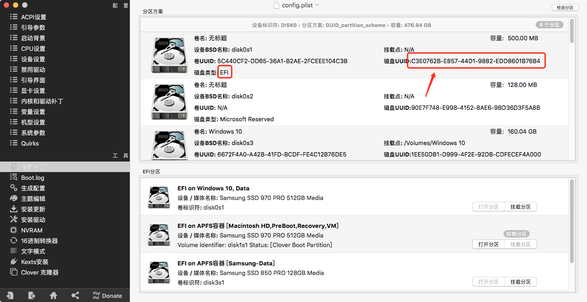
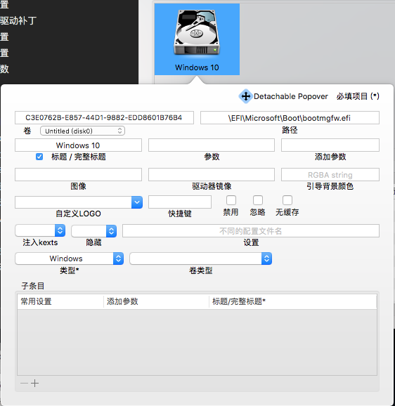

# MSI-B360M-MORTAR-EFI

## 一、EFI

配置：

- CPU:  Intel Core i5-9600K
- 主板：微星B360M迫击炮
- 内存：32GB DDR4 16GBX2
- 硬盘：Sansumg 850 PRO 128GB
        Sansumg 970 PRO 512GB x2
        HGST 500GB
- 显卡：ASUS GTX 1080
- 蓝牙：USB 型号：CSR8510 A10
- WIFI：无，推荐BCM94360或BCM94352免驱
- USB接口：主板自带4个2.0 1个3.1和一个type c，机箱前置面板2个3.0，已定制
- 声卡：未定制，使用voodooHDA.kext
- OS：10.13.6

## 二、注意

### 1.系统与clover版本不兼容

若`-v` 启动时提示版本不兼容之类的信息，请在`config.plist`中的`boot`选项中添加`-no_compat_check`参数跳过系统版本检查:
```
	<key>Boot</key>
	<dict>
		<key>Arguments</key>
		<string>-v -no_compat_check</string>
        ....
```

### 2.USB已特殊定制

定制教程参考(10.14以下版本需在clover中打usb端口限制补丁)：

- [Hackintool(原Intel FB-Patcher)使用教程及插入姿势](https://blog.daliansky.net/Intel-FB-Patcher-tutorial-and-insertion-pose.html)
- [使用 Hackintool 定制黑苹果 USB 端口，适用于 Clover & OpenCore](https://heipg.cn/tutorial/custom-usbports-for-hackintosh.html)
- [解决mac系统10.13.6与10.14下usb失效或者降速问题](https://blog.csdn.net/haoran61/article/details/84679957)
- `EFI-CLOVER-ACPI-patched`里的内容是定制的usb驱动，与`Tools-pathched`里的`USBPorts.kext`二选一

## 三、效果

- 概览


- 显示器


- 存储空间


- NVME


- SATA


- USB


- 网卡


- 蓝牙


- 图形卡


- 声卡


- CPU变频


- 内核扩展,只保留生效驱动


## 四、小贴士

### 1.正确识别显示器型号
`git clone` 或者下载[lihaoyun6](https://github.com/lihaoyun6)的开源项目[macOS-Displays-icon](https://github.com/lihaoyun6/macOS-Displays-icon),在macos终端下，用`sudo`权限执行`MonitorFace.sh`即可，之后打开`关于本机->显示器`即可看到效果

### 2.更改Windows的GUI

①.隐藏 Preboot 的盘符即可


②.记录引导Windows启动的EFI分区的 UUID


③.在GUI选项中新增一个启动项，命名为 Windows10 ，需要添加Windows启动的EFI分区的 UUID 和指定 Windows启动文件路径 ，并且设置 不隐藏，类型为 Windows


④.保存文件，重启即可看到效果
